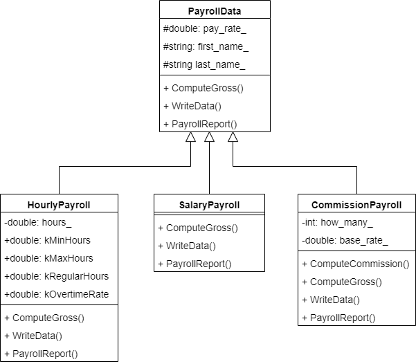

# CHALLENGE: THE PAYROLLDATA CLASS

In this activity we are going to revisit payroll data. 
In a previous activity we wrote the PayrollRecord class.
This class contained payroll information and was able to 
compute and display the gross pay. We computed gross pay for hourly employees.
Now we are going to expand the options to include salaried and commission 
employees as well.

Instead of having this functionality in a single class we are going to 
use inheritance. We will have a base class, PayrollData that will 
contain the common data members and functionality. Then we will 
have three subclasses: HourlyPayroll, SalaryPayroll, and 
CommissionPayroll. Each of these classes will implement the details 
that are specific to this type of payroll.

Then we will write a function the uses a vector of PayrollData 
pointers to run payroll for several employees. 


---
### Files to work on
We will be working in the following files.

- There is a library of classes that work with the 
`payroll_data` library. The library 
  consists of the following files:
  - `src/payroll_data.cpp`
  - `src/payroll_data.h`
  - `src/hourly_payroll.cpp`
  - `src/hourly_payroll.h`
  - `src/salary_payroll.cpp`
  - `src/salary_payroll.h`
  - `src/commission_payroll.cpp`
  - `src/commission_payroll.h`
- There will also be a  library `process_payroll` that 
contains the function for reading  PayrollData objects and 
writing payroll reports to a file. The library consists of 
these two files:
  - `src/process_payroll.cpp`
  - `src/process_payroll.h`
- Our "driver" will be `src/main.cpp`.
  
Please **DO NOT MODIFY** any other files. Modifying other files may result 
in the unit tests not passing.

---


In this activity we will be creating several classes. To see how the 
classes are related, consider the following UML class diagram.



---


## Part 1: Create the PayrollData Class  

We have worked with the `PayrollRecord` class in a Module 4, 
Challenge: The PayrollRecord Class. You may find it useful to use
much of the code from that activity. You may copy any code you wrote 
 for that activity to this one.
 
 Create the PayrollData class and add getter methods, setter methods, 
 constructors, and a destructor. 
 
 *Note*: Naming of the public interface is critical. It is important to 
 name the class and public members as specified. Otherwise, the unit 
 tests will not work.
 
 The class declaration is to go in the header file, `payroll_data.h`, 
 and the method implementations in `payroll_data.cpp`. You can have some
  methods be inline if they only have one or two statements.


### Part 1.1: Add the protected data members
The PayrollData class has three protected data members for the following 
values. These data members are protected to allow the subclasses to have 
direct access to these data members.
   - The pay rate. This is a double and stores how much the employee is paid
   per hour.
   - A first name. This is a string that contains the employee's first name 
   and any middle name or initial.
   - A last name. This is a string that contains the employee's last name.
   There are no spaces in the last name.

### Part 1.2: Add the getter methods
Add a getter method for each 
protected data member that returns its current value.
None of these getter methods will make changes to the actual object 
    so they can be const methods.

Here are the declarations for the getter methods.

```cpp
  double get_pay_rate() const;
  std::string get_first_name() const;
  std::string get_last_name() const;
```

### Part 1.3: Add the setter methods
The setter methods allow us to 
control what values the private data members can contain. There will be a 
setter method for each data member. Enforce the following.


   3. The pay rate is zero or greater. If a pay rate is a negative number, 
   set pay rate to 0. Notice this is different than the PayrollRecord setter.
   4. The name. Notice how this is one setter for two data members. When
   companies send the employee name it is the full name
   and has to be parsed to determine the first and last names. Any 
   middle name or initial is included in the first name.
   The name sent is either in first last format or last, 
   first format. The code is to handle either format and set the first 
   and last name data members. There is no space in the last name.

Here are the declarations for the setter methods.

```cpp
  void set_pay_rate(double pay_rate);
  void set_name(std::string name);
```
    
### Part 1.4: Add the default constructor

This constructor has no parameters and sets the following values.

- pay rate to 0
- first name to "it is"
- last name to "unknown"
    
Here is the declaration for the default constructor.

```cpp
  PayrollData();
```

### Part 1.5: Add a non-default constructor
This constructor has three parameters

- pay rate
- employee name

To set these values, call the setter methods. 

Here is the declaration  for the non-default constructor.

```cpp              
  PayrollData(double pay_rate, std::string name);
```

### Part 1.7: Add the destructor. 

Nothing needs to be done in the destructor. 
    
Here is the declaration  for the destructor.

```cpp
  ~PayrollData();
```

### Part 1.8: Add virtual method declarations

The PayrollData class will have three virtual methods. These methods 
will be different for each payroll 
type so we don't want to implement them in the base class. 

Remember to make these pure virtual methods you add `virtual` before the 
return type and set the declaration equal to 0. All of these methods are
const methods.

 - `ComputeGross` returns a double and has no parameters 
 - `WriteData` is a void method that receives one reference parameter, 
 an ostream object
 - `WriteReport` is a void method that receives one reference parameter, 
                   an ostream object
   
Since the `PayrollData` class now has pure virtual methods we are not 
able to declare any objects of type 
PayrollData. We will not be able to do any testing at this point.


---

## Part 2: Create the HourlyPayroll Class 
 

Now we will create the HourlyPayroll class. This type of payroll is 
computed using pay rate and number of hours worked. 

The HourlyPayroll class will inherit from the PayrollData class so it will 
get the data members and functionality that is defined in the PayrollData class. 

We will need an additional private data member and 
associated getters and setters. We will need to adapt the pay 
rate setter as there is a minimum wage for hourly employees. 
We will also need to implement the virtual methods of the base class.

### Part 2.1: Write HourlyPayroll Class Declaration

1. In the `hourly_payroll.h` file, add a declaration for the class 
named `HourlyPayroll`.

- The include guards are already in the file
- Add a declaration for the class `HourlyPayroll`
- Add the notation at the top of the `HourlyPayroll` class that 
has it inherit from the `PayrollData` class. Use public inheritance.

- Add one private data member.
   - a double that keeps track of hours worked
    
- add a public section with the following
  - five static constant data members
    - kMinHours - a double for the minimum number of hours allowed
    - kMaxHours - a double for the maximum number of hours allowed
    - kRegularHours - a double for the regular hours in a pay period
    - kOvertimeRate - a double that specifies the increase in rate for overtime hours
    - kMinWage - a double that specifies the minimum pay rate for hourly employees
  - two constructors and a destructor
    - HourlyPayroll();
    - HourlyPayroll(double hours_worked, double pay_rate, std::string name);
    - ~HourlyPayroll();
  - one getter
    - double get_hours() const;
  - two setters
    - void set_pay_rate(double pay_rate);
    - void set_hours(double hours_worked);
  - three other methods    
    - double ComputeGross() const;
    - void WriteData(std::ostream &out) const;
    - void WriteReport(std::ostream &out) const;

### Part 2.2: Write HourlyPayroll Class Implementation

1. In the hourly_payroll.cpp file `include` the hourly_payroll.h header file.

2. Write the definition for the static constants.
    - Set kMinHours to 0
    - Set kMaxHours to 168
    - Set kRegularHours to 40
    - Set kOvertimeRate to 1.5
    - Set kMinWage to 7.25
  
4. Write the implementation for the `getter`. The getter returns the value of the matching data member.

5. Write the implementation for the `setters`. 
    -  The set_pay_rate method sets the pay rate to the value sent. If the pay 
    rate sent is less than kMinWage it sets pay rate to kMinWage.
    -  The set_hours_worked method sets the hours worked data member to 
    the value sent. If the hours sent is less than kMinHours, set hours
     worked to kMinHours. If the hours sent is greater than 
    kMaxHours, set hours worked to kMaxHours.

6. Write the `default constructor`. 

    - The following will automatically be set by the PayrollData default constructor:
      - pay rate to 0
      - first name to 'it is'
      - last name to 'unknown'
    - Write the code to set the following:
      - pay rate to kMinWage
      - hours worked to kMinHours

7. Write the `non-default constructor`. 

    - This constructor is to call the setters in the HourlyPayroll class 
    to set the pay_rate, hours worked, and name to the values sent.
    
1. Write the `destructor`. It does not need to do anything. Just add the { }s
 
2. Implement the `ComputeGross` method. This method has no parameters. The method computes and returns the gross pay. 

    For hourly payroll, the computation depends on whether the hours worked 
    is greater than 40 hours or not. If the hours worked is 40 or less, 
    the gross pay is the number of hours worked times the pay rate.

    When the hours worked is greater than 40 and the pay type is hourly, 
    the gross is the sum of regular pay and overtime pay. The regular pay 
    is 40 hours times the pay rate. The overtime pay is the number of 
    hours over 40 times the pay rate times 1.5. 

    Use the static member variables in the base class for the 
    regular hours(40) and overtime rate (1.5).

    Return the gross pay.
  
10. Implement the `WriteData` method.
  
    This method will output the data for the hourly payroll. 
    This is similar to the WriteData
    method in the PayrollRecord class but this one includes the `H`. The method has 
    one parameter and returns nothing. This parameter is of type ostream 
    which is an output stream and can be either the standard cout or an 
    ofstream object. It is passed by reference because it actually 
    makes changes to the output stream such as where the file pointer is.

    The WriteData method is to write the following data to the output 
    stream. It is to be written on two lines. Be careful to output the 
    details exactly including capitalization, comma, and spacing.
    
    Set the precision on the output stream to display two digits after 
    the decimal place.

    - The first line contains four items separated by a space
      - H
      - hours worked
      - pay rate
      - gross pay
    - The second line contains a name in last, first format and ends with a carriage return

    For example, consider the payroll data with name Kim Watson that has a pay rate of 23.50 and worked 43.5 hours. 
    The payroll data would look like this:
    
    ```
    H 23.50 43.50 1063.38
    Watson, Kim
    ```
    This method will not make changes to the actual object so it can be a 
    const method.
    
11. Implement the `WriteReport` method. This is the same as the WriteReport
method in the PayrollRecord class. This prints the payroll data in 
a more human readable form. It includes the data with labels. This 
method has one parameter and returns nothing. The parameter is of 
type ostream which is an output stream and can be either the standard 
cout or an ofstream object. 

    The WriteReport method is to write the following report to the output stream. 
    It is to be written on four lines as shown below. Lines 2-4 start with three
    spaces.
        
        First Last
           Hours Worked: hours
           Pay Rate: $rate
           Gross Pay: $gross
    
    Set the precision on the output stream to display two digits after the decimal place.
    
    Example:
    
        Kim Watson
           Hours Worked: 43.50
           Pay Rate: $23.50
           Gross Pay: $123.38
    
    This method makes no change to the object itself so it can be a const method.       

### Part 2.3: Use the HourlyPayroll Class in Main.cpp

Now we can use the HourlyPayroll class in main. 

1. Create 
HourlyPayroll objects using the default and non-default
constructors.

2. Use the HourlyPayroll objects to call the getter and
setter methods. Print out the results to see that the
methods are doing what is expected.

3. Use the HourlyPayroll objects to call the 
ComputeGross method. Print out the results to see that the
method is doing what is expected.

4. Use the HourlyPayroll objects to call the WriteData
and WriteReport methods to see they are working 
as expected.


### Part 2.4: Run the unit tests


Run the unit tests for the HourlyPayroll class.

9. Now run all the tests on the `HourlyPayroll` class by running
main_test.

10. If any of the tests fail, make changes until all
the unit tests pass.

---

## Part 3: CREATE THE SALARYPAYROLL CLASS 

Now we will create the SalaryPayroll class. The gross pay for this type 
of payroll takes no computation at all. The pay rate is the salary 
amount which is the gross amount the employee will be paid for the pay period. 

The SalaryPayroll class will inherit from the PayrollData 
class so it will get the data members and functionality that is 
defined in the PayrollData class. 

There will be no additional private data members so no associated getters 
and setters. We will need to implement 
the virtual methods of the base class.


### Part 3.1: Write SalaryPayroll Class Declaration

1. In the `salary_payroll.h` file add a declaration for the 
class named `SalaryPayroll`.

    - The include guards are already in the file
    - Add a declaration for the class `SalaryPayroll`
    - Add the notation at the top of the `SalaryPayroll` class 
    that has it inherit from the `PayrollData` class. Use public 
    inheritance.
    
    - add a public section with the following
      - two constructors and a destructor
        - SalaryPayroll();
        - SalaryPayroll(double pay_rate, std::string name);
        - ~SalaryPayroll();
      - three other methods    
        - double ComputeGross() const;
        - void WriteData(std::ostream &out) const;
        - void WriteReport(std::ostream &out) const;


### Part 3.2: Write SalaryPayroll Class Implementation

2. In the salary_payroll.cpp file `include` the salary_payroll.h header file.

3. Write the `default constructor`. 

    - The following will automatically be set by the PayrollData default constructor:
      - pay rate to 0
      - first name to 'it is'
      - last name to 'unknown'
    - These values will work fine for us so nothing else needs to be done in the default constructor.

4. Write the `non-default constructor`. 

    - This constructor is to call the base class constructor with 
    the values sent for pay rate and name.
      
5. Write the `destructor`. It does not need to do anything. Just add the { }s
 
6. Implement the `ComputeGross` method. This method has no parameters. The method computes and returns the gross pay. 

    For salary payroll, the pay rate for the employee is the gross pay for the pay period. This method just returns 
    the pay rate.
  
7. Implement the `WriteData` method.
  
    This method will output the data for the salary payroll. 
    The method has one parameter and returns nothing. 
    This parameter is of type ostream which is an output 
    stream and can be either the standard cout or an 
    ofstream object. It is passed by reference because 
    it actually makes changes to the output stream such as 
    where the file pointer is.
    
    The WriteData method is to write the following data to 
    the output stream. It is to be written on two lines. 
    Be careful to output the details exactly including 
    capitalization, comma, and spacing.

    - The first line contains two items separated by a space
        - S
        - pay rate
    - The second line contains a name in last, first format and ends with a carriage return
  
    Set the precision on the output stream to display two digits after the decimal place.
      
    For example, consider the payroll data with name Kim 
    Watson that has a pay rate of 2350. The payroll data 
    would look like this:
      
    ```
    S 2350.00
    Kim Watson
    ```
   This method will not make changes to the actual object so it can be a const method.
    
8.  Implement the `WriteReport` method. This prints the payroll 
data in a more human readable form. It includes the data with 
labels. This method has one parameter and returns nothing. 
The parameter is of type ostream which is an output stream and 
can be either the standard cout or an ofstream object. 

    Set the precision on the output stream to display two digits after the decimal place.
    
    The WriteReport method is to write the following report to 
    the output stream. It is to be written on three lines as 
    shown below. There are three spaces at the beginning of 
    lines 2 & 3.
    ```  
      Name
         Pay Rate: $rate
         Gross Pay: $gross
    ```
    Replace Name, rate, and gross with the 
    actual values. Be careful to output the details exactly 
    including capitalization, :, $, and spaces.

    For example, consider the payroll data with name Kim Watson 
    who has a pay rate of 2350. The payroll report 
    would look like this:
    ```
    Kim Watson
       Pay Rate: $2350.00
       Gross Pay: $2350.00
    ```
    This method makes no change to the object itself so it can be a const method.

### Part 3.3: Use the SalaryPayroll Class in Main.cpp

Now we can use the SalaryPayroll class in main. 

1. Create 
SalaryPayroll objects using the default and non-default
constructors.

2. Use the SalaryPayroll objects to call the getter and
setter methods. Print out the results to see that the
methods are doing what is expected. Notice that the
SalaryPayroll does not define any new getters and
setters but still use the ones that are defined
in the PayrollData
class. 

3. Use the SalaryPayroll objects to call the 
ComputeGross method. Print out the results to see that the
method is doing what is expected.

4. Use the SalaryPayroll objects to call the WriteData
and WriteReport methods to see they are working 
as expected.


### Part 3.4: Run the unit tests

Run the unit tests for the SalaryPayroll class.

8. In the tests/CMakeLists.txt (there are three CMakeLists.txt 
files so be sure to get the one in the tests folder) uncomment 
the line for salary_payroll by removing the # at the beginning of the line.

    ```
    set(UNIT_TEST_LIST 
      hourly_payroll
      salary_payroll          #uncomment to run salary_payroll tests
      #commission_payroll      #uncomment to run commission_payroll tests
      #process_payroll         #uncomment to run process_payroll tests
      )  
    ```
   Then click the Reload Changes message at the top of the 
   tests/CMakeLists.txt file.

9. Now run all the tests on the `SalaryPayroll` class by running
main_test.

10. If any of the tests fail, make changes until all
the unit tests pass.


---

## Part 4: CREATE THE COMMISSIONPAYROLL CLASS 

Now we will create the CommissionPayroll class. This type 
employee gets a base wage plus commission. The total pay is 
computed using pay rate, how many, and base pay. The commission 
is computed by multiplying the pay rate by how many. For 
example if the pay rate is $35.50 and the how many is 82, 
then the commission is $2911.00. The gross pay is the base pay 
plus commission. So if this same employee has a base pay of 
820.00, then the gross pay is $3731.00.

The CommissionPayroll class will inherit from the PayrollData 
class so it will get the data members and functionality that 
is defined in the PayrollData class. 

We will need an additional private data member and associated 
getters and setters. We will add a new method that 
computes the commission. We will also need to implement the 
virtual methods of the base class.


### Part 4.1: Write CommissionPayroll Class Declaration

1. In the `commission_payroll.h` file add a declaration for 
the class named `CommissionPayroll`.
    
    - The include guards are already in the file
    - Add a declaration for the class `CommissionPayroll`
    - Add the notation at the top of the `CommissionPayroll` class 
    that has it inherit from the `PayrollData` class. Use public 
    inheritance.
    
    - Add two private data members.
     - an int that keeps track of how many
     - a double that keeps track of base pay
      
    - Add a public section with the following
       - two constructors and a destructor
          - CommissionPayroll();
          - CommissionPayroll(double pay_rate, int how_many, double base_pay,
                            std::string name);
          - ~CommissionPayroll();
        - two getters
          - int get_how_many() const;
          - double get_base_pay() const;
        - two setters
          - void set_how_many(int how_many);
          - void set_base_pay(double base_pay);
        - four other methods    
          - double ComputeCommission() const;
          - double ComputeGross() const;
          - void WriteData(std::ostream &out) const;
          - void WriteReport(std::ostream &out) const;


### Part 4.2: Write CommisionPayroll Class Implementation

2. In the commission_payroll.cpp file `include` the 
commission_payroll.h 
header file.

3. Write the implementation for the `getters`. The getters return the values of the matching data members.

4. Write the implementation for the `setters`. 
    -  The set_how_many method sets how many to the value sent. 
    If how many is less than 0 
    set how many to 0.
    -  The set_base_pay method sets the base pay 
    data member to the value sent. If the base pay sent is less 
    than 0 set base pay to0.

5. Write the `default constructor`. 

    - The following will automatically be set by the PayrollData default constructor:
      - pay rate to 0
      - first name to 'it is'
      - last name to 'unknown'
    - Write the code to set the following:
      - how many to 0
      - base rate to 0

6. Write the `non-default constructor`. 

    - This constructor is to call the base class constructor with the values sent for pay rate and name.
    - Then it is to call the setters in the CommissionPayroll class to set how many and base pay to the values sent. 
      
7. Write the `destructor`. It does not need to do anything. Just add the { }s

8. Implement the `ComputeCommission` method. This method has no parameters. The method computes and returns the 
commission. Commission is computed by multiplying pay rate by how many.
 
9. Implement the `ComputeGross` method. This method has no parameters. The method computes and returns the gross 
pay. Gross pay is computed by adding the base pay and the commission.
  
10. Implement the `WriteData` method.
    
    This method will output the data for the commission payroll. The method has one parameter and returns 
    nothing. This parameter is of type ostream which is an output stream and can be either the standard cout or 
    an ofstream object. It is passed by reference because it actually makes changes to the output stream such 
    as where the file pointer is.
    
    The WriteData method is to write the following data to the output stream. It is to be written on two lines. 
    Be careful to output the details exactly including capitalization, comma, and spacing.
    
    - The first line contains five items separated by a space
        - C
        - pay rate
        - how many
        - base pay
        - gross pay
    - The second line contains a name in last, first format and ends with a carriage return
   
    Set the precision on the output stream to display 
      two digits after the decimal place.
       
    For example, consider the payroll data with name Kim Watson that has a pay rate of 41.80, sold 12 items, and 
    has a base pay of 880. The payroll data would look like this:
         
    ```
    C 41.80 12 880.00 1381.60
    Kim Watson
    ```
    This method will not make changes to the actual object so it can be a const method.

11. Implement the `WriteReport` method. This prints the payroll data in a more human readable form. It includes the 
data with labels. This method has one parameter and returns nothing. The parameter is of type ostream which is an 
output stream and can be either the standard cout or an ofstream object. 

    The WriteReport method is to write the following report to the output stream. It is to be written on four lines 
    as shown below.

     ``` 
      Name
         Pay Rate: $rate
         How Many: how many
         Commission: $commission
         Base Pay: $base
         Gross Pay: $gross
      ```

    Replace Name, rate, how many, commission, base, and gross with the 
    actual values. Be careful to output the details exactly including capitalization, :, $, and spacing.

    Use setprecision and fixed on the output stream to display two digits after the decimal place.

    For example, consider the payroll data with name Kim Watson that has a pay rate of 41.80, sold 12 items, and 
    has a base pay of 880. The payroll report 
    would look like this:

    ```
      Kim Watson
         Pay Rate: $41.80
         How Many: 12
         Commission: $501.60
         Base Pay: $880.00
         Gross Pay: $1381.60
    ```
    This method makes no change to the object itself so it can be a const method.

### Part 4.3: Use the ComputeCommission Class in Main.cpp

Now we can use the ComputeCommission class in main. 

1. Create 
CommissionPayroll objects using the default and non-default
constructors.

2. Use the CommissionPayroll objects to call the getter and
setter methods. Print out the results to see that the
methods are doing what is expected.

3. Use the CommissionPayroll objects to call the 
ComputeCommission method. Print out the results to see that the
method is doing what is expected.

3. Use the CommissionPayroll objects to call the 
ComputeGross method. Print out the results to see that the
method is doing what is expected.

4. Use the CommissionPayroll objects to call the WriteData
and WriteReport methods to see they are working 
as expected.


### Part 4.4: Run the unit tests


Run the unit tests for the CommissionPayroll class.

8. In the tests/CMakeLists.txt (there are three CMakeLists.txt 
files so be sure to get the one in the tests folder) uncomment the line 
for commission_payroll by removing the # at the beginning of the line.

    ```
    set(UNIT_TEST_LIST 
      hourly_payroll
      salary_payroll          #uncomment to run salary_payroll tests
      commission_payroll      #uncomment to run commission_payroll tests
      #process_payroll         #uncomment to run process_payroll tests
      )  
    ```
   Then click the Reload Changes message at the top of the 
   tests/CMakeLists.txt file.

9. Now run all the tests on the `CommissionPayroll` class by running
main_test.

10. If any of the tests fail, make changes until all
the unit tests pass.

---

## Part 5: Write the ProcessPayroll Function (30 POINTS) 

Now that we have all the payroll data classes developed we 
can process payroll data. We will do this in the ProcessPayroll 
function. The declaration for this function will be written in 
the process_payroll.h file and the implementation will be in 
the process_payroll.cpp file.

This function receives two strings. The first string is the 
path and filename for the input file that contains the payroll 
data. The second string is the path and filename for the output 
file where the payroll reports will be written.

The ProcessPayroll function has a vector of PayrollData 
pointers. This can contain pointers to HourlyPayroll, 
SalaryPayroll, and CommissionPayroll objects. The function 
reads a set of data from the file. Then it creates a new object 
that matches the payroll type and stores the pointer in the 
vector. 

After all the data in the file has been read and stored, 
the ProcessPayroll function loops through the vector and 
prints a payroll report for each object to the output file. 

There is a sample set of payroll data in the file 
payroll_week23.txt. You can use this to test your function.


### Part 5.1: Write ProcessPayroll Function Declaration


1. In the `process_payroll.h` file add a declaration for the 
function named `ProcessPayroll`. 
   - The include guards are already in the file
   - Include the string header file
   - Add the declaration for the ProcessPayroll function:
   
   void ProcessPayroll(std::string inputFile, std::string outputFile);


### Part 5.2: Write ProcessPayroll Function Implementation

2. In the process_payroll.cpp file `include` all the header files needed.
   - start with the process_payroll.h header file
   - fstream
   - string
   - vector
   - commission_payroll.h
   - hourly_payroll.h
   - payroll_data.h
   - salary_payroll.h

3. Write the implementation for the `ProcessPayroll` function. 

    - declare and open an ifstream object with the filename sent in first parameter
    - if the file does not work for some reason, print an error message and return from the function
    - declare a vector of PayrollData pointers
    - declare variables to hold the following values as they are read from the file
      - type
      - pay rate
      - hours
      - how many
      - base pay
      - name
    - create a loop that will read all the data from the file

      The first thing for each set of payroll data is the payroll type. This is a single character. You can use 
      this in the condition of the while loop. 
      
      For the condition of the while loop read in the payroll type. This loop will read until it gets to the end 
      of the file.

      The payroll data will be different for each type so inside the 
      while loop use a switch statement or an if/else 
      if statement to read the specific data for each type of payroll. 
      Remember to use the ignore and getline functions when reading the name. 

      With that data, create a new object of the matching payroll type and add the pointer to the vector. 

    - declare and open an ofstream object with the filename sent in second parameter
    - loop through the vector and output a payroll report for each object
    - loop through the vector and do the following
      - delete the dynamic memory pointed to by each pointer
      - set the pointer to NULL
         
    If you are using a for range loop, remember to pass the value by reference so the pointer will actually be changed.


### Part 5.3: Use the ProcessPayroll Function in Main.cpp

Now we can use the ProcessPayroll function. 

1. In main, call the
ProcessPayroll function. See that it is producing the
expected report.  
 
 
### Part 5.4: Run the unit tests

Run the unit tests for the ProcessPayroll function. 

8. In the tests/CMakeLists.txt (there are three CMakeLists.txt 
files so be sure to get the one in the tests folder) uncomment 
the line for process_payroll by removing the # at the beginning of the line.

    ```
    set(UNIT_TEST_LIST 
      hourly_payroll
      salary_payroll          #uncomment to run salary_payroll tests
      commission_payroll      #uncomment to run commission_payroll tests
      process_payroll         #uncomment to run process_payroll tests
      )  
    ```
   Then click the Reload Changes message at the top of the 
   tests/CMakeLists.txt file.

9. Now run all the tests on the `ProcessPayroll` functoin by running
main_test.

10. If any of the tests fail, make changes until all
the unit tests pass.

---

## Validate your code

Once you are satisfied with your work, run the unit test file:

From the dropdown select main_test and run.

Sample output:

Tests passed: 83 of 83 tests

---

## Submit your code

Zip your src folder and submit in Canvas.

---